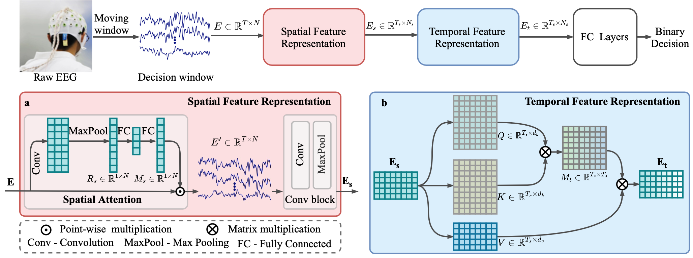

# STAnet: A Spatiotemporal Attention Network for Decoding Auditory Spatial Attention From EEG

This repository contains the python scripts developed as a part of the work presented in the paper "STAnet: A Spatiotemporal Attention Network for Decoding Auditory Spatial Attention From EEG"

## Getting Started

These files are extracted from the project stream, which contain the complete model and some training parameters.  In order to run the project, users need to write training and testing code, and use private or public datasets.

The public [KUL dataset](https://doi.org/10.5281/zenodo.3997352) and [DTU dataset](https://doi.org/10.5281/zenodo.1199011) is used in the paper. The dataset itself comes with matlab processing program, please adjust it according to your own needs.

## Paper

Paper Link: [**STAnet: A Spatiotemporal Attention Network for Decoding Auditory Spatial Attention From EEG**](https://ieeexplore.ieee.org/abstract/document/9669037)

A schematic diagram of the proposed spatiotemporal attention network, i.e., STAnet, which mainly consists of three components: spatial feature representation, temporal feature representation, and classification module. Taking EEG data as input, the network is trained to detect auditory spatial attention by making a binary decision.

## License

This project is licensed under the MIT License - see the [LICENSE](LICENSE) file for details

## Contact

Enze Su, Siqi Cai, Longhan Xie, Haizhou Li, Tanja Schultz

Shien-Ming Wu School of Intelligent Engineering, South China University of Technology, Guangzhou, Guangdong Province, China.

